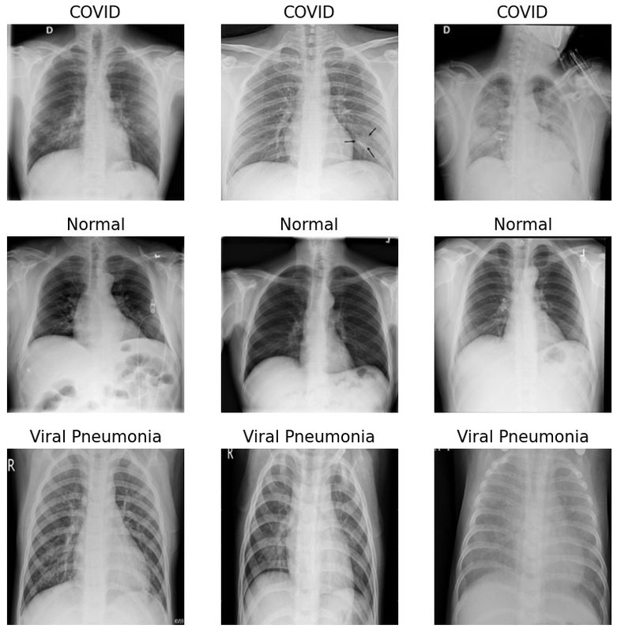

# CS 534 - Artificial Intelligence

## Assessment of SOTA Deep Neural Networks for the Detection of COVID-19 via Chest X-Ray

This repository contains the code developed for the CS 534 group project. The project focuses on the assessment of SOTA Deep Neural Networks for the Detection of COVID-19 via Chest X-Rays. 

A full write up of the project is available in the `docs` folder.

## Team Members

Azzam Shaikh, Anoushka Baidya, Chaitanya Gokule, and Cristobal Rincon Rogers

## Abstract

At the end of 2019, Wuhan, China, emerged as the ground zero for the outbreak of COVID-19, a disease caused by the SARS-CoV-2 virus, leading to a worldwide health emergency declared by the World Health Organization. With the virus affecting 216 countries and causing extensive morbidity and mortality, accurately differentiating COVID-19 from similar respiratory diseases became imperative. Leveraging artificial intelligence, specifically state-of-the-art convolutional neural networks, offers a promising solution for enhancing the accuracy and speed of diagnosing COVID-19 through chest X-rays. Given the varied state-of-the-art convolutional neural networks (CNNs) explored for COVID-19 detection in chest X-rays, this paper synthesizes these approaches to present a comprehensive analysis. This project delves into the effectiveness, adaptability, and efficiency of pretrained state-of-the-art models like ResNet-50, VGG-19, and InceptionV3. Furthermore, fine-tuned state-of-the-art models, such as COVID-ResNet, DarkCovidNet, and DenseNet169 and XGBoost, are evaluated to determine if fine-tuned models provide significant benefits over renown, pretrained models, assessing their diagnostic accuracy and operational benefits. Through a rigorous evaluation framework involving accuracy, sensitivity, specificity, and computational efficiency, this project aims to identify the most promising CNN architectures for real-world application, offering a path forward in enhancing rapid and reliable COVID-19 screening methods. Based on the results of the testing accomplished, it was determined that the DenseNet169 and XGBoost model developed by Nasiri & Hasani provides the best results, based on MCC score, to determine COVID-19 in chest x-rays. 
